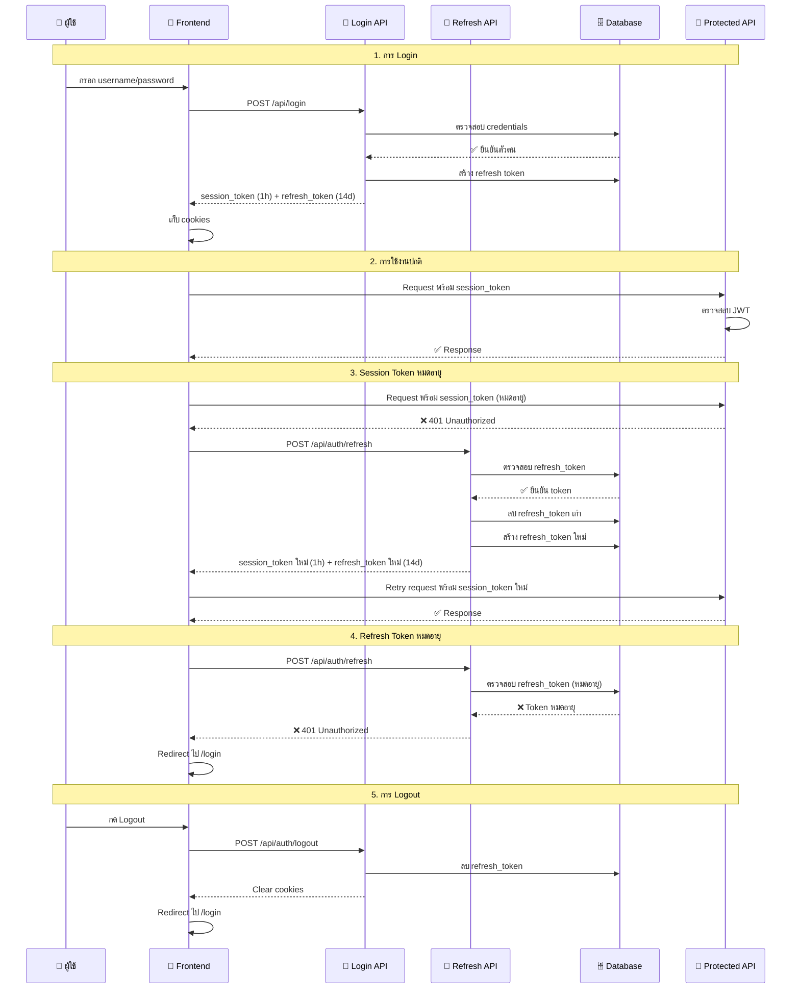

# 🔐 Token Flow System - MedError

## 📋 Overview
ระบบใช้ **Session Token** และ **Refresh Token** ร่วมกันเพื่อความปลอดภัยและประสบการณ์ผู้ใช้ที่ดี

---

## 🔄 Token Flow Diagram



---

## 🎯 Token Types

### 🔑 Session Token (Access Token)
```typescript
// ตัวอย่าง Session Token
{
  "id": "user123",
  "sub": "user123", 
  "onboarded": true,
  "organizationId": "org456",
  "role": "USER",
  "exp": 1640995200 // หมดอายุใน 1 ชั่วโมง
}
```

**คุณสมบัติ:**
- ⏰ **อายุ**: 1 ชั่วโมง
- 🎯 **วัตถุประสงค์**: เข้าถึง API และตรวจสอบสิทธิ์
- 🔒 **ความปลอดภัย**: อายุสั้น ลดความเสี่ยง
- 📍 **ตำแหน่ง**: HTTP-only cookie

### 🔄 Refresh Token
```typescript
// ตัวอย่าง Refresh Token ใน Database
{
  "id": "token789",
  "token": "abc123def456...", // 32 bytes hex
  "accountId": "user123",
  "expiresAt": "2024-02-15T10:00:00Z", // 14 วัน
  "createdAt": "2024-01-16T10:00:00Z"
}
```

**คุณสมบัติ:**
- ⏰ **อายุ**: 14 วัน
- 🎯 **วัตถุประสงค์**: สร้าง session token ใหม่
- 🔒 **ความปลอดภัย**: เก็บใน database, rotate ทุกครั้ง
- 📍 **ตำแหน่ง**: HTTP-only cookie

---

## 🛡️ Security Features

### 1. Token Rotation
```typescript
// ทุกครั้งที่ใช้ refresh token จะสร้างใหม่
const newRefreshToken = randomBytes(32).toString('hex');
await prisma.refreshToken.delete({ where: { id: tokenRecord.id } });
await prisma.refreshToken.create({ data: { token: newRefreshToken, ... } });
```

### 2. Activity Tracking
```typescript
// ตรวจสอบการใช้งานล่าสุด
const hoursSinceLastActivity = (now.getTime() - lastActivity.getTime()) / (1000 * 60 * 60);
if (hoursSinceLastActivity > 2) {
  // ลบ token หากไม่ใช้งานเกิน 2 ชั่วโมง
}
```

### 3. Auto Refresh
```typescript
// Frontend auto refresh ทุก 50 นาที
useEffect(() => {
  const interval = setInterval(async () => {
    await fetch('/api/auth/refresh', { method: 'POST' });
  }, 50 * 60 * 1000); // 50 นาที
}, []);
```

---

## 🔄 State Management

### Frontend States
```typescript
// ตัวอย่างจาก useAuth hook
const [user, setUser] = useState<User | null>(null);
const [loading, setLoading] = useState(true);
const [error, setError] = useState<string | null>(null);
```

### Error Handling
```typescript
// เมื่อ session หมดอายุ
if (response.status === 401) {
  // ลอง refresh token
  const refreshResponse = await fetch('/api/auth/refresh');
  if (!refreshResponse.ok) {
    setError('Session expired');
    setUser(null);
  }
}
```

---

## 🧹 Cleanup Process

### Database Cleanup
```typescript
// ลบ token ที่หมดอายุ
await prisma.refreshToken.deleteMany({
  where: { expiresAt: { lt: new Date() } }
});

// ลบ token ที่ไม่ใช้งาน
await prisma.refreshToken.deleteMany({
  where: { 
    account: { lastActivityAt: { lt: twoHoursAgo } }
  }
});
```

---

## 📊 Benefits

| ด้าน | ประโยชน์ |
|------|----------|
| 🔒 **ความปลอดภัย** | Session token อายุสั้น, Token rotation, Activity tracking |
| 👤 **User Experience** | ไม่ต้อง login ใหม่ทุก 1 ชั่วโมง, Auto refresh |
| 🛠️ **การจัดการ** | Centralized token management, Easy logout |
| 📈 **Scalability** | Stateless session validation, Database tracking |

---

## 🚨 Common Scenarios

### ✅ Success Flow
1. Login → ได้ session token + refresh token
2. ใช้งานปกติ → session token ยังไม่หมดอายุ
3. Session หมดอายุ → auto refresh → ได้ token ใหม่
4. ใช้งานต่อได้ปกติ

### ❌ Error Flow
1. Session หมดอายุ → refresh token หมดอายุด้วย
2. Redirect ไป login หน้า
3. ต้อง login ใหม่

### 🔄 Logout Flow
1. ลบ refresh token จาก database
2. Clear cookies ทั้งหมด
3. Redirect ไป login หน้า

---

## 💡 Best Practices

1. **Always use HTTPS** ใน production
2. **Set appropriate cookie flags** (httpOnly, secure, sameSite)
3. **Implement rate limiting** สำหรับ refresh endpoint
4. **Log security events** สำหรับ audit
5. **Regular cleanup** ของ expired tokens
6. **Monitor token usage** patterns

---

*Token Flow System นี้ช่วยให้แอปพลิเคชันมีความปลอดภัยสูงโดยไม่กระทบต่อประสบการณ์ผู้ใช้* 